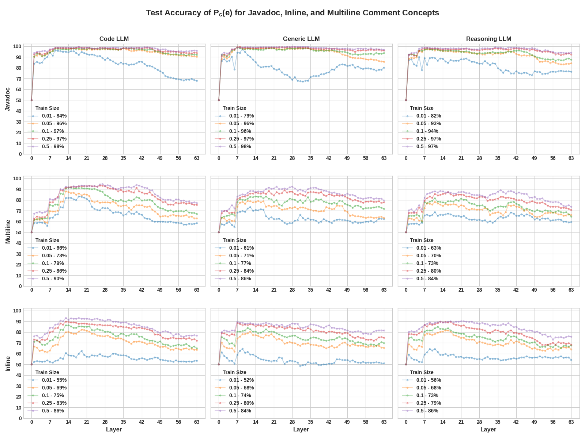

# Inside Out: Uncovering How Comment Internalization Steers LLMs for Better or Worse

 [](LICENSE) 


## Setup Instructions

1. Run the following command to add the current directory to the python path:

```bash
export PYTHONPATH=$PYTHONPATH:$(pwd)
export TF_ENABLE_ONEDNN_OPTS=0
```

2. Install miniconda or anaconda. Then, using the following command, create the environments required for the experiments:

```bash
conda env create -f torch-env.yml
conda env create -f ollm.yml
```

Due to conflicting dependencies, please try running RQ1 and RQ2 in the `torch-env` environment, the baseline results for RQ3 in the `ollm` environment, and the CA and CD experiments in RQ3 using the `torch-env` environment.

## Setup Local Inference for Producing Baseline Results in RQ3

Install miniconda by following the [instructions](https://docs.anaconda.com/miniconda/install/#quick-command-line-install) based on your operating system.
Then, use the following command to set up a local inference environment:

```bash
conda create -n sglang
conda activate sglang
pip install --upgrade pip
pip install uv
uv pip install "sglang[all]>=0.4.3.post2" --find-links https://flashinfer.ai/whl/cu124/torch2.5/flashinfer-python
python -m sglang.launch_server --model-path <model-name> --port 49999 --host 0.0.0.0
```

Look for a log message like `max_total_num_tokens=15919, max_prefill_tokens=16384, max_running_requests=2049, context_len=12000` in the logs to get the maximum number of tokens that can be processed by the server.
Then, rename the `.env.example` file to `.env` and set the `MAX_TOTAL_NUM_TOKENS` environment variable to the maximum number of tokens that can be processed by the server. This is required for running the inference tasks.


## RQ1

Please refer to [tcav/README.md](tcav/README.md) for instructions on replicating the results of RQ1 and generating the plots.

## RQ2

The median test accuracy for `Javadoc`, `Inline`, and `Multiline` across all models is shown below:



To replicate the results of RQ2, please refer to [tcav/README.md](tcav/README.md) for instructions on training the classifiers and generating the plots.

## RQ3

The tasks are located in the `tasks` directory. To replicate the results of RQ3 for each task, please refer to the respective `README.md` files in the task directory within the `tasks` directory. The `Sheets` directory contains the performance results of the experiments for each task, including the baseline results, Concept Activation (**CA**), and Concept Deactivation (**CD**) results across all LLMs, metrics, and tasks.

**NEW (Added as part of revisions):** For convenience, we also provide the results of RQ3 for Code Translation to C, C++, and Go below:

**SR:** Success Rate, $\mathbf{SR^\alpha}$: Commented SR, $\mathbf{SR^\gamma}$: Comment-free SR. **Bold**: Largest impact of activating or deactivating a concept. <ins>Underlined</ins>: Largest overall impact from activation and deactivation across concepts and LLMs.

### RQ3 results for Code Translation to Python

Refer to Table 3 in the paper. 

### RQ3 results for Code Translation to C

| **Concept**           | **LLM** | $\mathbf{SR^\alpha}$ **/ CD SR** ($\mathbf{\Delta_{rel}}$) | $\mathbf{SR^\gamma}$**/ CA SR**  ($\mathbf{\Delta_{rel}}$) |
|----------------------------|--------------|--------------------------------------------------------|---------------------------------------------------------|
| Comment   | Code         | 67.44 / 60.47 (-10.34\%)                                 | 69.77 / 65.12 (-6.67\%)        |
|                            | Generic      | 55.81 / 58.14 (4.17\%)                       | 53.49 / 53.49 (0.00\%)                                 |
|                            | Reasoning    | **79.07 / 90.70 (14.71\%)**                                | <ins>**72.09 / 60.47 (-16.13\%)**</ins>**                                |
| Javadoc   | Code         | 66.67 / 58.33 (-12.5\%)                                | **69.77 / 65.12 (-6.67\%)**                        |
|                            | Generic      | <ins>**66.67 / 50.00 (-25.00\%)**</ins>    | 53.49 / 55.81 (4.35\%)                                  |
|                            | Reasoning    | 75.00 / 58.33 (-22.22\%)                                 | 72.09 / 72.09 (0.00\%)                                  |
| Inline    | Code         | 87.50 / 87.50 (0.00\%)                       | 69.77 / 69.77 (0.00\%)                                 |
|                            | Generic      | **81.25 / 68.75 (-15.38\%)**                                | 53.49 / 55.81 (4.35\%)                        |
|                            | Reasoning    | 87.50 / 87.50 (0.00\%)                                 | **72.09 / 79.07 (9.68\%)**                                 |
| Multiline | Code         | 46.67 / 46.67 (0.00\%)                                   | **69.77 / 62.79 (-10.00\%)**                                 |
|                            | Generic      | 20.00 / 20.00 (0.00\%)                       | 53.49 / 51.16 (-4.35\%)                                  |
|                            | Reasoning    | **73.33 / 80.00 (9.09\%)**                                 | 72.09 / 67.44 (-6.45\%)                       |

### RQ3 results for Code Translation to C++

| **Concept**           | **LLM** | **$\mathbf{SR^\alpha}$ / CD SR ($\Delta_{rel}$)** | **$\mathbf{SR^\gamma}$/ CA SR  ($\Delta_{rel}$)** |
|----------------------------|--------------|--------------------------------------------------------|---------------------------------------------------------|
| Comment   | Code         | 69.77 / 60.47 (-13.33\%)                                 | 67.44 / 62.79 (-6.90\%)        |
|                            | Generic      | **53.49 / 65.12 (21.74\%)**                       | 62.79 / 62.79 (0.00\%)                                 |
|                            | Reasoning    | 65.12 / 74.42 (14.29\%)                                | <ins>**65.12 / 51.16 (-21.43\%)**</ins>**                                |
| Javadoc   | Code         | 58.33 / 50.00 (-14.29\%)                                | **67.44 / 60.47 (-10.34\%)**                        |
|                            | Generic      | **41.67 / 50.00 (20.00\%)**    | 62.79 / 58.14 (-7.41\%)                                  |
|                            | Reasoning    | 58.33 / 50.00 (-14.29\%)                                 | 65.12 / 67.44 (3.57\%)                                  |
| Inline    | Code         | **87.50 / 10.00 (14.29\%)**                       | **67.44 / 55.81 (-17.24\%)**                                 |
|                            | Generic      | 75.00 / 75.00 (0.00\%)                                | 62.79 / 58.14 (-7.41\%)                        |
|                            | Reasoning    | 87.50 / 87.50 (0.00\%)                                 | 65.12 / 67.44 (3.57\%)                                 |
| Multiline | Code         | <ins>**60.00 / 40.00 (-33.33\%)**</ins>                                   | 67.44 / 65.12 (-3.45\%)                                 |
|                            | Generic      | 40.00 / 40.00 (0.00\%)                       | **62.79 / 60.47 (-3.70\%)**                                  |
|                            | Reasoning    | 46.67 / 53.33 (14.29\%)                                 | 65.12 / 65.12 (0.00\%)                       |

### RQ3 results for Code Translation to Go

| **Concept**           | **LLM** | **$\mathbf{SR^\alpha}$ / CD SR ($\Delta_{rel}$)** | **$\mathbf{SR^\gamma}$/ CA SR  ($\Delta_{rel}$)** |
|----------------------------|--------------|--------------------------------------------------------|---------------------------------------------------------|
| Comment   | Code         | 53.49 / 58.14 (8.70\%)                                 | 53.49 / 53.49 (0.00\%)        |
|                            | Generic      | **27.91 / 34.88 (25.00\%)**                       | **30.23 / 25.58 (-15.38\%)**                                 |
|                            | Reasoning    | 60.47 / 53.49 (-11.54\%)                                | 51.16 / 48.84 (-4.55\%)                                |
| Javadoc   | Code         | 41.67 / 41.67 (0.00\%)                                | 53.49 / 55.81 (4.35\%)                        |
|                            | Generic      | <ins>**16.67 / 25.00 (50.00\%)**</ins>    | 30.23 / 34.88 (15.38\%)                                  |
|                            | Reasoning    | 50.00 / 58.33 (16.67\%)                                 | **51.16 / 62.79 (22.73\%)**                                  |
| Inline    | Code         | **56.25 / 68.75 (22.22\%)**                       | 53.49 / 53.49 (0.00\%)                                 |
|                            | Generic      | 50.00 / 56.25 (12.50\%)                                | 30.23 / 32.56 (7.69\%)                        |
|                            | Reasoning    | 87.50 / 93.75 (7.14\%)                                 | **51.16 / 60.47 (18.18\%)**                                 |
| Multiline | Code         | **75.00 / 93.75 (25.00\%)**                                   | 53.49 / 55.81 (4.35\%)                                 |
|                            | Generic      | 43.75 / 50.00 (14.29\%)                       | 30.23 / 32.56 (7.69\%)                                  |
|                            | Reasoning    | 62.50 / 68.75 (10.00\%)                                 | <ins>**51.16 / 65.12 (27.27\%)**</ins>                       |


## RQ4

The task instructions for each of the 10 SE tasks are located in the `rq4/prompts.json` file. We list them below for reference:

```json
{
    "code summarization": "Summarize the following function in one sentence.\n{code}",
    "code translation": "Translate this code from Java to Python.\n{code}",
    "test generation": "Write test cases for the following class to check its correctness.\n{code}",
    "code completion": "Complete the last line of the following code snippet.\n{code}",
    "fault localization": "Identify the buggy line(s) in the following code that cause it to fail.\n{code}",
    "program repair": "Fix the bug in the following code snippet to make it work as intended.\n{code}",
    "vulnerability detection": "Does the following code contain any security vulnerabilities? If yes, describe them.\n{code}",
    "code review": "Review the following code change and provide suggestions for improvement.\n{code}",
    "code refactoring": "Optimize the following code to improve performance without changing its output.\n{code}",
    "code documentation": "Generate inline comments and a docstring for the following function.\n{code}"
}
```

The `{code}` placeholder will be replaced with the actual code snippet for each task.
To run RQ4 experiments, please refer run the following command:

```bash
cd rq4
python run_rq4.py
```


## Citation
If you found this work helpful, please consider citing it using the following:

```bibtex
@misc{imani2025insideoutuncoveringcomment,
      title={Inside Out: Uncovering How Comment Internalization Steers LLMs for Better or Worse}, 
      author={Aaron Imani and Mohammad Moshirpour and Iftekhar Ahmed},
      year={2025},
      eprint={2512.16790},
      archivePrefix={arXiv},
      primaryClass={cs.SE},
      url={https://arxiv.org/abs/2512.16790}, 
}
```
